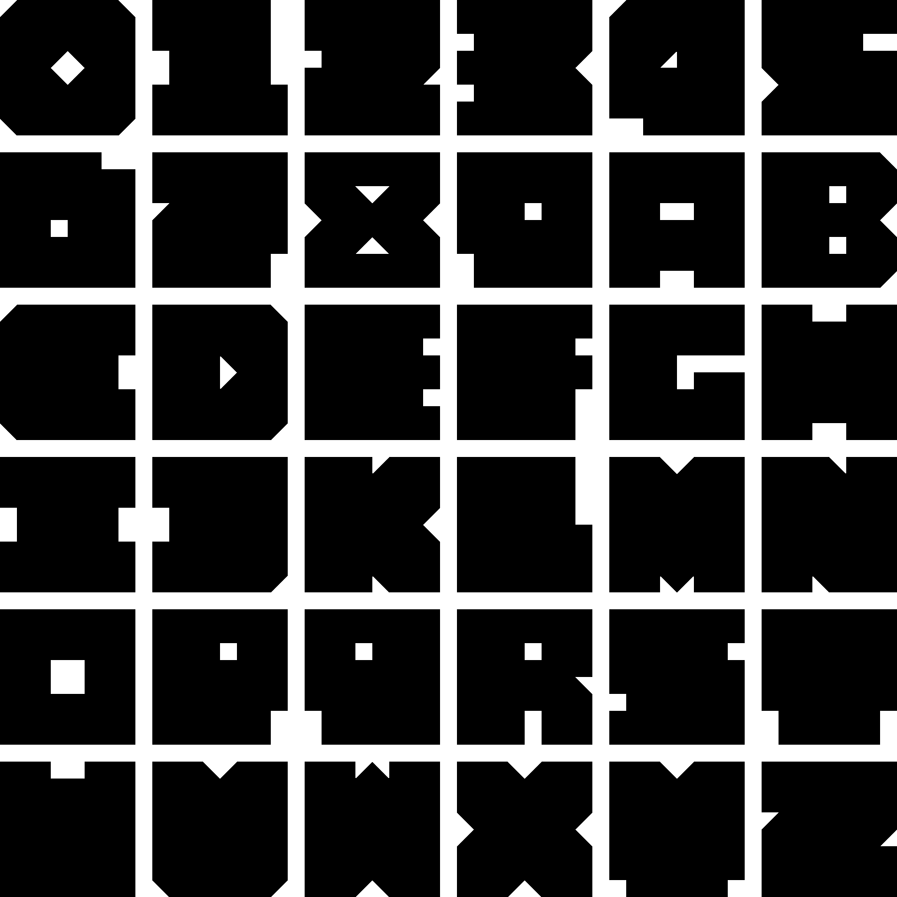
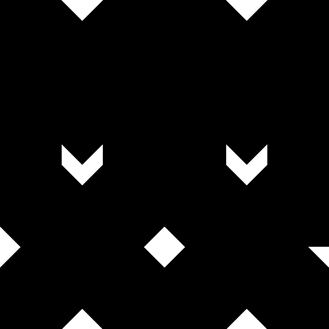

# MMXX

Constructivist typeface.

## Letter Sample



## Web Fonts

```css
@font-face {
  font-family: "MMXX";
  src:
    url("https://hetcdn.nl/fonts/mmxx.woff2") format("woff2"),
    url("https://hetcdn.nl/fonts/mmxx.woff") format("woff"),
    url("https://hetcdn.nl/fonts/mmxx.ttf") format("truetype");
  font-weight: 400;
  font-style: normal;
  font-display: swap;
}

:root {
    --font-mmxx: "MMXX", system-ui, sans-serif;
}

.font--mmxx {
    font-family: var(--font-mmxx);
    font-variant-ligatures: none;
}
```

### CDN

```html
<link rel="stylesheet" href="https://hetcdn.nl/fonts/mmxx.css">
```

## Logo



## Tools

### Generate Video

```bash
python tools/generate-video.py --char a --theme classic
python tools/generate-video.py --chars abcd --theme diamond --gap 1
python tools/generate-video.py --char a --theme camo
python tools/generate-video.py --char a --gif some.gif
```
